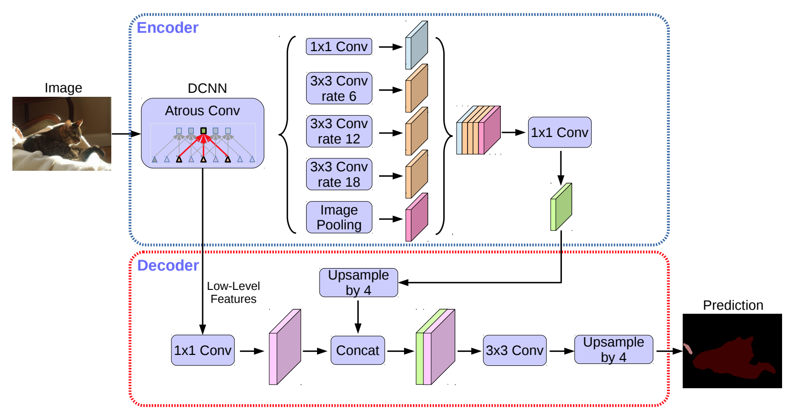

# DeepLabV3-Plus (Ongoing)

[](https://tensorflow.org/)

[](https://mybinder.org/v2/gh/deepwrex/DeepLabV3-Plus/augmentations)

Tensorflow 2.2.0 implementation of DeepLabV3-Plus architecture as proposed by the paper [Encoder-Decoder with Atrous Separable
Convolution for Semantic Image Segmentation](https://arxiv.org/pdf/1802.02611.pdf).



**Project Link:** [https://github.com/deepwrex/DeepLabV3-Plus/projects/](https://github.com/deepwrex/DeepLabV3-Plus/projects/).

**Experiments:** [https://app.wandb.ai/19soumik-rakshit96/deeplabv3-plus](https://app.wandb.ai/19soumik-rakshit96/deeplabv3-plus).

Model Architectures can be found [here](./models.md).

## Setup Datasets

- **CamVid**
    
    ```shell script
    cd dataset
    bash camvid.sh
    ```

- **Multi-Person Human Parsing**

    Register on [https://www.kaggle.com/](https://www.kaggle.com/).

    Generate Kaggle API Token

    ```shell script
    bash download_human_parsing_dataset.sh <kaggle-username> <kaggle-key>
    ```


## Code to test Model

```python
from src.model.deeplabv3_plus import DeeplabV3Plus

model = DeepLabV3Plus(backbone='resnet101')
model.summary()
```

## Training

```shell script
wandb login <login-key>
python3 train.py
```

If you want to use a custom configuration, you can define it in the following way:

```python
from glob import glob
import tensorflow as tf
from train import Trainer

# Sample Configuration
config = {
    'wandb_api_key': 'kjbckajsbdksjbdkajsbkdasbkdj',
    'project_name': 'deeplabv3-plus',
    'experiment_name': 'human-parsing-resnet-50-backbone',
    'train_dataset_configs': {
        'images': sorted(glob(
            './dataset/instance-level_human_parsing/instance-level_human_parsing/Training/Images/*'
        )),
        'labels': sorted(glob(
            './dataset/instance-level_human_parsing/instance-level_human_parsing/Training/Category_ids/*'
        )),
        'height': 512, 'width': 512, 'batch_size': 8
    },
    'val_dataset_configs': {
        'images': sorted(glob(
            './dataset/instance-level_human_parsing/instance-level_human_parsing/Validation/Images/*'
        )),
        'labels': sorted(glob(
            './dataset/instance-level_human_parsing/instance-level_human_parsing/Validation/Category_ids/*'
        )),
        'height': 512, 'width': 512, 'batch_size': 8
    },
    'strategy': tf.distribute.OneDeviceStrategy(device="/gpu:0"),
    'num_classes': 20, 'height': 512, 'width': 512,
    'backbone': 'resnet50', 'learning_rate': 0.0001,
    'checkpoint_path': 'deeplabv3-plus-human-parsing-resnet-50-backbone.h5',
    'epochs': 100
}

trainer = Trainer(config)
trainer.connect_wandb()
history = trainer.train()
```

## Inference

Sample Inferece Code:

```python
model_file = './dataset/deeplabv3-plus-human-parsing-resnet-50-backbone.h5'
train_images = glob('./dataset/instance-level_human_parsing/Training/Images/*')
val_images = glob('./dataset/instance-level_human_parsing/Validation/Images/*')
test_images = glob('./dataset/instance-level_human_parsing/Testing/Images/*')


def plot_predictions(images_list, size):
    for image_file in images_list:
        image_tensor = read_image(image_file, size)
        prediction = infer(
            image_tensor=image_tensor,
            model_file=model_file
        )
        plot_samples_matplotlib(
            [image_tensor, prediction], figsize=(10, 6)
        )

plot_predictions(train_images[:4], (512, 512))
```

## Results

### Multi-Person Human Parsing


#### Training Set Results


#### Validation Set Results


#### Test Set Results


## Citation

```
@misc{1802.02611,
    Author = {Liang-Chieh Chen and Yukun Zhu and George Papandreou and Florian Schroff and Hartwig Adam},
    Title = {Encoder-Decoder with Atrous Separable Convolution for Semantic Image Segmentation},
    Year = {2018},
    Eprint = {arXiv:1802.02611},
}
```